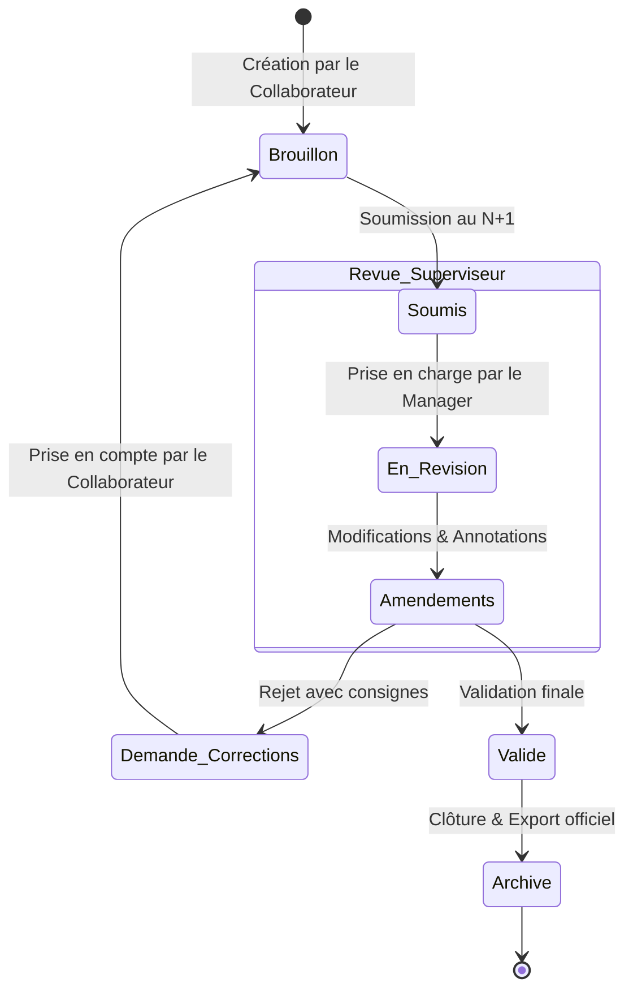

# Product Requirements Document (PRD) — Planit

## 1. Vue d'ensemble du produit
**Planit** est une plateforme de productivité et de gestion de tâches hautement sécurisée, conçue pour les équipes et les professionnels exigeant un contrôle rigoureux de leur planning, de leurs échéances et de la confidentialité de leurs données.

## 2. Objectifs & Public Cible
- **Objectifs** : Offrir un espace de travail centralisé, fluide et réactif permettant de planifier, suivre et accomplir des tâches avec des vues dynamiques (Liste, Calendrier, Kanban).
- **Public Cible** : Équipes d'entreprise, chefs de projets, indépendants et utilisateurs recherchant une organisation rigoureuse avec authentification sécurisée.

## 3. Modules Fonctionnels Principaux

### 3.1. Authentification & Sécurité ("Espace Confidentiel")
- Inscription et connexion sécurisées par email et mot de passe via **Better Auth**.
- Gestion des rôles utilisateur (`member`, `admin`).
- Protection stricte des routes et des données personnelles (chiffrement et isolation des sessions).

### 3.2. Gestion des Tâches & Projets
- CRUD complet des tâches (titre, description, date d'échéance, priorité, statut, catégorie).
- Assignation de membres d'équipe et suivi de progression.
- Filtres avancés par recherche, statut et niveau d'urgence.

### 3.3. Vues d'Organisation Interactives
- **Vue Liste** : Tableau récapitulatif avec actions rapides.
- **Vue Calendrier** : Visualisation temporelle des tâches et des rappels.
- **Vue Kanban** : Colonnes dynamiques par état d'avancement.

### 3.4. Rappels & Notifications
- Système de rappels configurables avant échéance.
- Compteurs de notifications non lues et alertes visuelles.

### 3.5. Plateforme Collaborative & Circuit de Revue Métier
Plateforme interne collaborative en temps réel conçue pour décloisonner et sécuriser le travail entre les départements **Fiscalité**, **Comptabilité** et **Juridique**. Elle intègre un moteur de validation hiérarchique (*Maker-Checker*), un système de comparaison de versions (*Diff Viewer*) et un journal d'audit immuable pour garantir la conformité et zéro défaut sur les livrables clients.

#### 3.5.1. Circuit de Validation Hiérarchique (Maker-Checker)
* **Cycle de vie strict des dossiers :** `Brouillon` ➔ `Soumis pour Revue` ➔ `En Révision` ➔ `Demande de Corrections` ➔ `Approuvé & Verrouillé`.
* **Attribution dynamique :** Assignation automatique ou manuelle d'un superviseur / manager selon le département et la typologie du dossier.
* **Verrouillage préventif :** Empêche l'édition concurrente non autorisée pendant qu'un supérieur amende le travail.

#### 3.5.2. Visualisation des Modifications (Diff & Audit Trail)
* **Diff côté données :** Comparaison instantanée avant/après sur les montants, dates, formulaires et ratios financiers.
* **Suivi des modifications textuelles :** Mise en surbrillance des ajouts (vert) et suppressions (rouge) sur les projets d'actes juridiques, notes de synthèse et conclusions fiscales.
* **Journalisation légale :** Traçabilité immuable (qui a modifié quel champ, à quelle seconde, depuis quelle IP).

#### 3.5.3. Collaboration Interdépartements & Temps Réel
* **Indicateurs de présence en direct :** Sachez instantanément qui consulte ou révise quel dossier grâce à *Phoenix Presence*.
* **Notifications réactives :** Mises à jour des statuts sans rechargement de page (*WebSockets*).
* **Passerelles inter-pôles :** Demande simplifiée de pièces de la compta vers le juridique ou la fiscalité avec suivi des blocages.

#### 3.5.4. Machine à États du Workflow (Workflow State Machine)

## 4. Exigences Non-Fonctionnelles
- **Performance** : Temps de chargement initial minimal, rendu hybride Server/Client Components optimisé sous Next.js 15.
- **Accessibilité & Design** : Interface épurée respectant les normes d'accessibilité (contraste WCAG AA, design responsive mobile et desktop).
- **Sécurité des données** : Isolation stricte des requêtes API et validation rigoureuse des entrées utilisateur.
