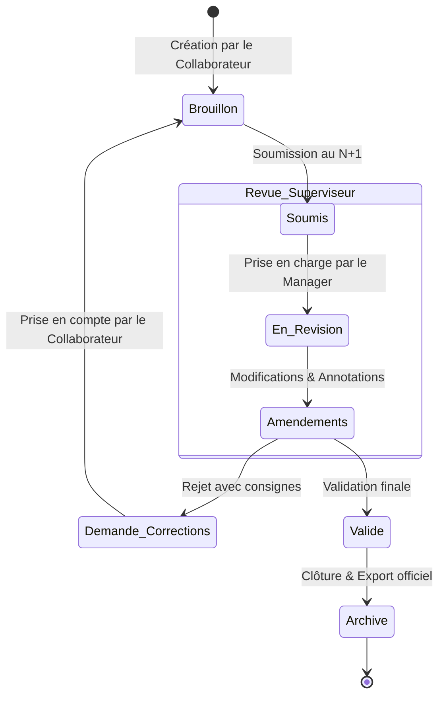

# Planit — Tâches, Calendrier & Rappels Intelligents

Planit est une application web moderne de productivité et de gestion de tâches collaborative, conçue pour organiser les journées, suivre les échéances et synchroniser les équipes en temps réel avec un haut niveau de sécurité (chiffrement et authentification renforcée).

---

## 🚀 Fonctionnalités Clés

- **Gestion des Tâches Avancée** : Création, édition, catégorisation, priorisation (Basse, Moyenne, Haute, Urgente), statuts (À faire, En cours, Terminée) et étiquettes personnalisées.
- **Vues Multiples** :
  - **Vue Liste** : Vue claire avec filtres par statut, priorité et recherche textuelle.
  - **Vue Calendrier** : Planification interactive des tâches et des rappels par jour, semaine ou mois.
  - **Vue Tableau (Kanban)** : Organisation par colonnes de statut glissantes.
- **Sécurité & Authentification (Better Auth)** :
  - Authentification sécurisée par email et mot de passe.
  - Gestion des rôles et des équipes (RBAC).
  - Sessions chiffrées compatibles avec les environnements conteneurisés et iframes.
- **Rappels & Notifications** : Alertes et gestion des échéances avec compteurs de rappels actifs.
- **Mode Hors-Ligne & Persistance Cloud** : Stockage persistant via PostgreSQL / Drizzle ORM avec résilience hors-ligne.

---

## 🤝 Plateforme Collaborative & Circuit de Revue Métier

Plateforme interne collaborative en temps réel conçue pour décloisonner et sécuriser le travail entre les départements **Fiscalité**, **Comptabilité** et **Juridique**.  
> Elle intègre un moteur de validation hiérarchique (*Maker-Checker*), un système de comparaison de versions (*Diff Viewer*) et un journal d'audit immuable pour garantir la conformité et zéro défaut sur les livrables clients.

### 1. Circuit de Validation Hiérarchique (Maker-Checker)
* **Cycle de vie strict des dossiers :** `Brouillon` ➔ `Soumis pour Revue` ➔ `En Révision` ➔ `Demande de Corrections` ➔ `Approuvé & Verrouillé`.
* **Attribution dynamique :** Assignation automatique ou manuelle d'un superviseur / manager selon le département et la typologie du dossier.
* **Verrouillage préventif :** Empêche l'édition concurrente non autorisée pendant qu'un supérieur amende le travail.

### 2. Visualisation des Modifications (Diff & Audit Trail)
* **Diff côté données :** Comparaison instantanée avant/après sur les montants, dates, formulaires et ratios financiers.
* **Suivi des modifications textuelles :** Mise en surbrillance des ajouts (vert) et suppressions (rouge) sur les projets d'actes juridiques, notes de synthèse et conclusions fiscales.
* **Journalisation légale :** Traçabilité immuable (qui a modifié quel champ, à quelle seconde, depuis quelle IP).

### 3. Collaboration Interdépartements & Temps Réel
* **Indicateurs de présence en direct :** Sachez instantanément qui consulte ou révise quel dossier grâce à *Phoenix Presence*.
* **Notifications réactives :** Mises à jour des statuts sans rechargement de page (*WebSockets*).
* **Passerelles inter-pôles :** Demande simplifiée de pièces de la compta vers le juridique ou la fiscalité avec suivi des blocages.

### 🔄 Machine à États du Workflow (Workflow State Machine)



---

## 🛠️ Stack Technique

- **Framework** : Next.js 15 (App Router, Server Actions, API Routes)
- **Langage** : TypeScript
- **Style** : Tailwind CSS v4, Lucide React (Icônes)
- **Authentification** : Better Auth
- **Base de Données & ORM** : PostgreSQL / SQLite (via Drizzle ORM)
- **Animations** : Motion (Framer Motion)

---

## ⚙️ Installation & Développement Local

1. Cloner le projet et installer les dépendances :
   ```bash
   npm install
   ```
2. Configurer les variables d'environnement dans `.env` (basé sur `.env.example`) :
   ```env
   BETTER_AUTH_SECRET=votre_secret_securise
   DATABASE_URL=postgres://...
   APP_URL=http://localhost:3000
   ```
3. Lancer le serveur de développement :
   ```bash
   npm run dev
   ```
4. Ouvrir [http://localhost:3000](http://localhost:3000) dans votre navigateur.
